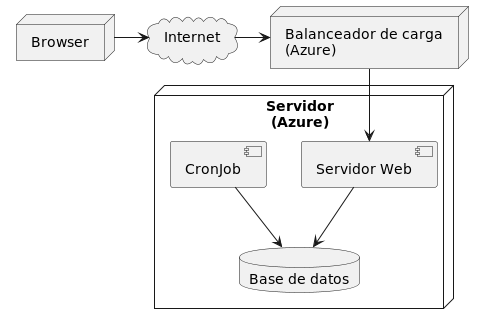

# 2022-tpa-vi-no-grupo-16



## Documentación

La documentación se encuentra en la carpeta [docs](docs/README.md).

## Dependencias

- Java 8
- Maven 3.8 o superior
- Docker (con Docker Compose plugin)

## Setup del Docker

1. Crear un archivo `.env` basándose en el ejemplo que se encuentra en
   `.env.example`

2. Crear un volumen externo en donde guardar los datos:

```bash
docker volume create impactoambiental-data
```

### Ejecutar en local

1. Levantar solo el Postgres por primera vez para crear la base de datos

```bash
docker compose up db
```

2. Editar la conexión a la base de datos para que apunte a `localhost:5432`

3. Ejecutar desde IntelliJ la clase `Bootstrap`.

- Para reiniciar la db, ejecutar:

```sh
docker rm impactoambiental-db
docker volume rm impactoambiental-data
docker volume create impactoambiental-data
docker compose up db
```


### Ejecutar desde Docker Compose

1. Editar la conexión a la base de datos para que apunte a `db:5432`

2. Buildear y levantar todos los containers (la db, el cron y la app).

```bash
docker compose up --build
```

## Despliegue en Railway

1. Crear un proyecto en [Railway](https://railway.app/)
2. Usar la opción "Provision PostgreSQL" y copiar los datos de conexión
3. Desplegar la aplicación Java mediante la opción "Deploy from GitHub repo" y 
   agregando las variables de entorno necesarias (ver `.env.example`).
   Usar `RAILWAY_DOCKERFILE_PATH=java.Dockerfile` 
4. Desplegar el cron job repitiendo el paso 3 pero usando 
   `RAILWAY_DOCKERFILE_PATH=cron.Dockerfile`.
