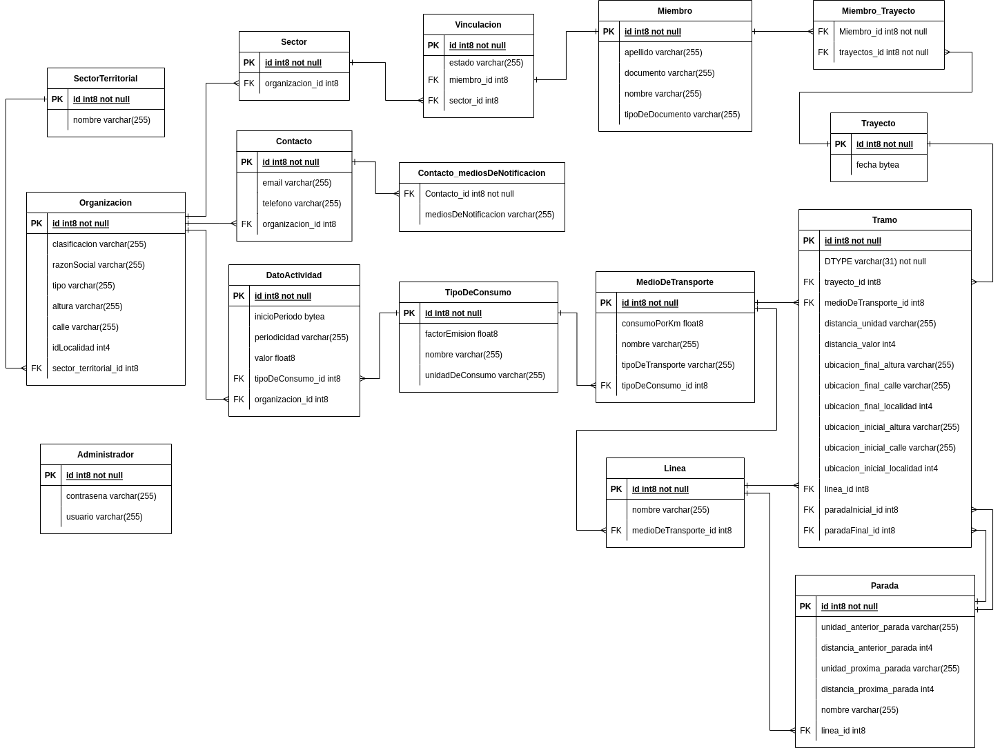
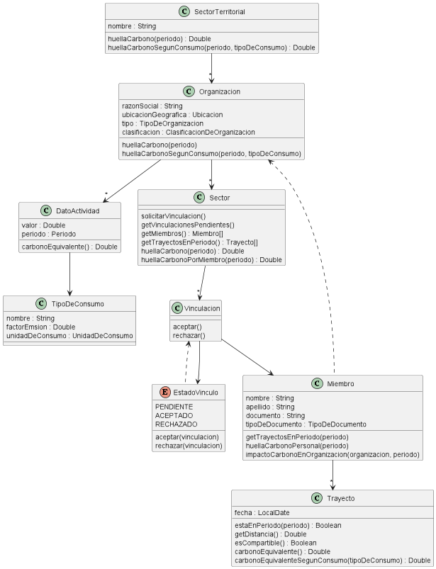
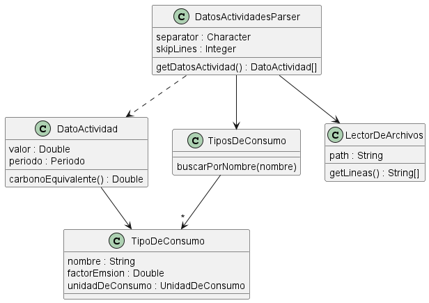
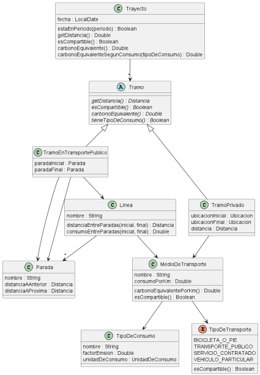
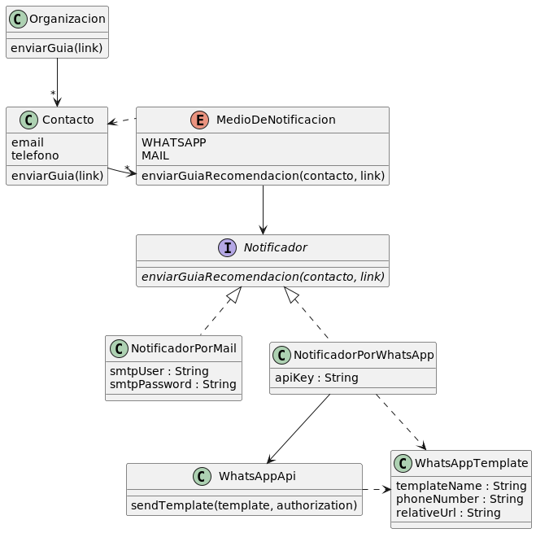
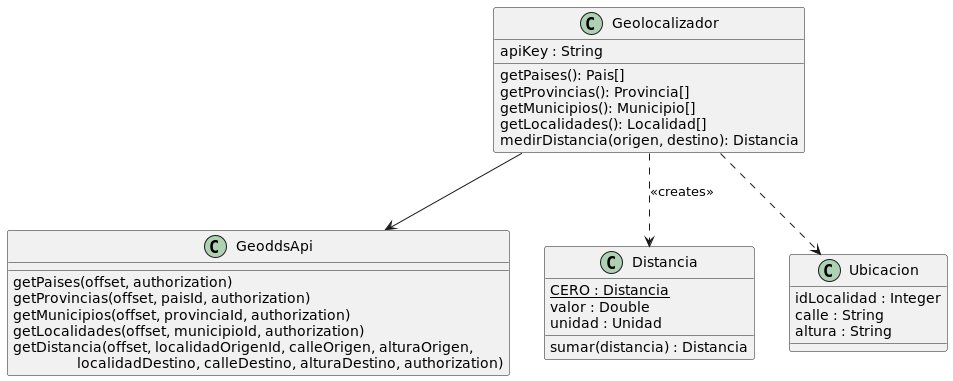
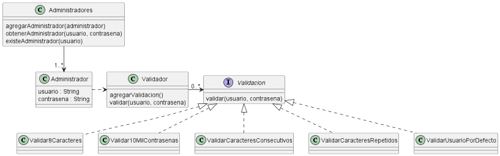

# Documentación

## Modelo de Datos

## Modelo de Objetos

### Organizaciones

- Cálculo de HC (territorial, organizacional, sectorial y por miembro)
- Vinculaciones de miembros a sectores

## Datos de Actividad

- Parseo de datos de actividad

## Tramos

- Cálculo de HC (por trayecto y por tramo)
- Tipos de medios de transporte
- Carga de líneas de transporte público y servicios contratados

## Notificaciones

- Envío de guías de recomendaciones

## Geolocalización

## Administradores

